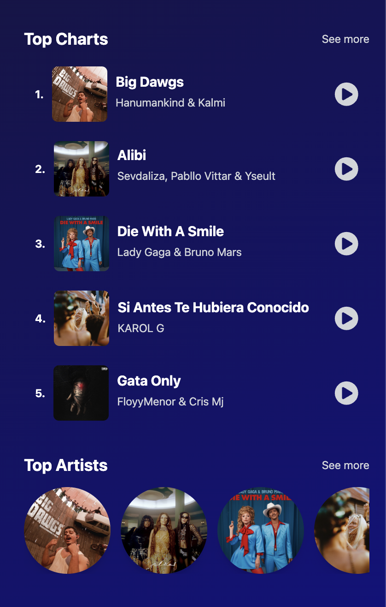
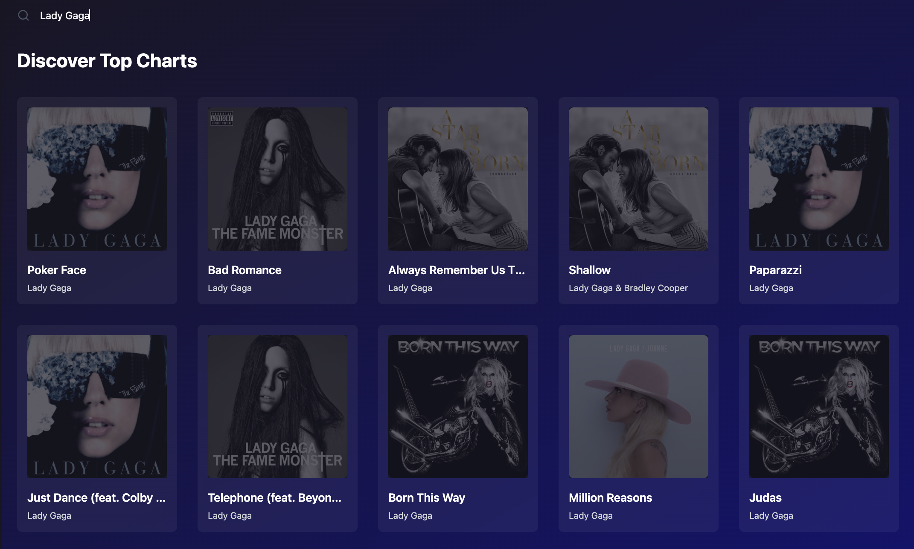
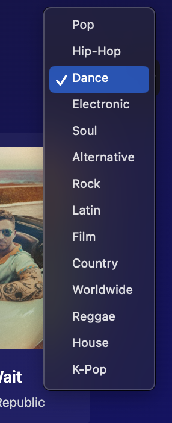
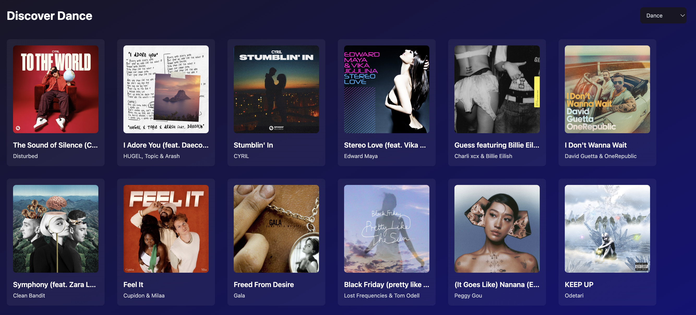
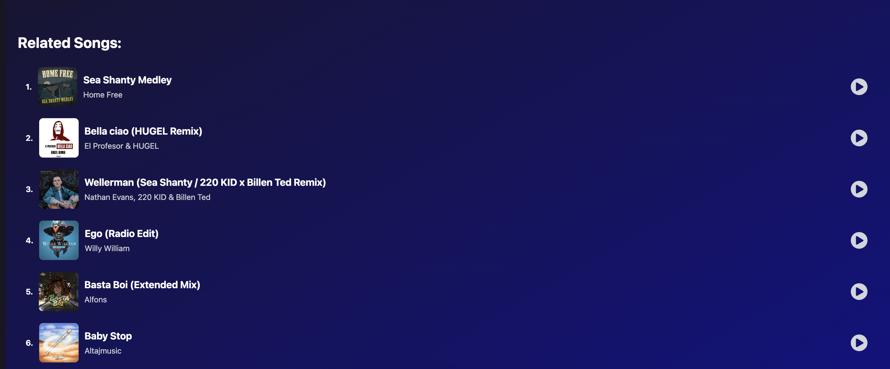
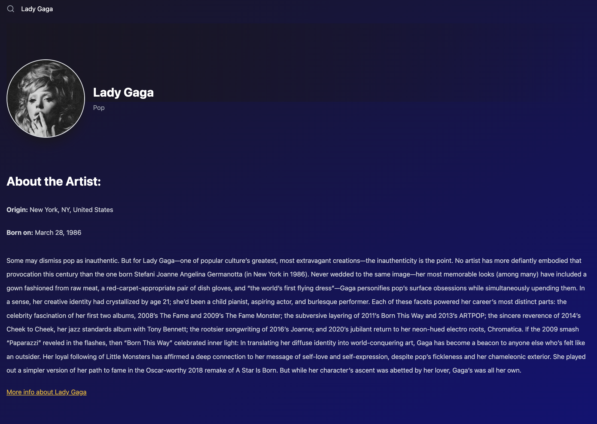
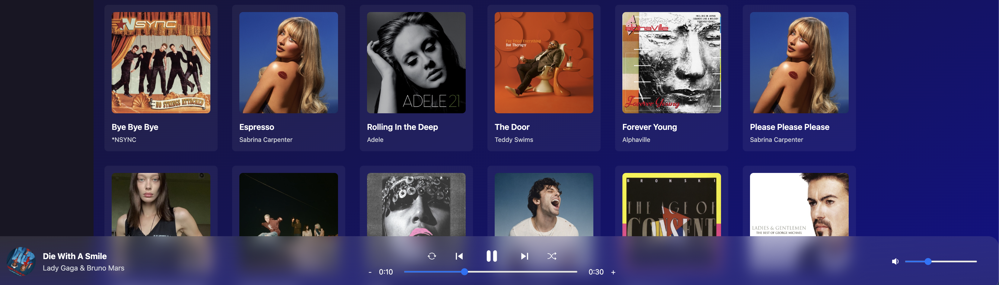

# Lyriks

**Lyriks** is an innovative music discovery application developed using React and Vite, leveraging the Shazam API to offer an engaging and interactive music experience. With Lyriks, users can explore new music, view top charts, and learn more about their favorite artists seamlessly.

## Table of Contents

- [Features](#features)
- [Installation](#installation)
- [Usage](#usage)
- [Screenshots](#screenshots)
- [License](#license)

## Features

- **Discover Music**  
  Explore and filter music by genres on the main page. Find new tracks and artists that match your taste.

- **Around You**  
  Discover top-charted music based on your current location. See what’s trending in your area.

- **Top Charts**  
  View the latest music charts, featuring trending songs and albums from various genres.

- **Top Artists**  
  Browse popular artists and check out their top tracks and albums.

- **Search Functionality**  
  Search for music by artist name. Get detailed results and discover new tracks.

- **Song Details**  
  Click on any song to preview it. Access additional information and related tracks.

- **Artist Details**  
  View detailed artist profiles, including bios and links for more information.

## Installation

To set up and run Lyriks on your local machine, follow these steps:

1. **Clone the Repository**

  
   git clone https://github.com/yourusername/lyriks.git
Navigate to the Project Directory

2. **Navigate to the Project Directory**
cd lyriks

3. **Install Dependencies**
npm install

4. **Start the Development Server**
npm run dev

## Usage

**Discover Music**
Go to the Discover Music page to explore new tracks.
Use the genre filters to find music that suits your preferences.

**Around You**
Access the Around You page to view top music based on your geographical location.
Enable location services to get accurate results.

**Top Charts**
Visit the Top Charts page to see the latest trending music.
Explore various charts to find popular songs and albums.

**Top Artists**
Navigate to the Top Artists section to discover popular artists.
Click on artist names to view their top tracks and albums.

**Search for Music**
Use the search bar to find music by artist name.
View search results and explore new tracks based on your query.

**Song Details**
Click on a song to preview it.
Access additional details such as related tracks and more information.

**Artist Details**
Click on an artist to view their bio and other details.
Find links for more information about the artist.

## Screenshots
Here are some screenshots showcasing the features of Lyriks:

This project was initially developed following a YouTube tutorial by JS Mastery. It involved extensive modifications to adapt to updates in the Shazam API, demonstrating my ability to troubleshoot and enhance solutions beyond the original scope.